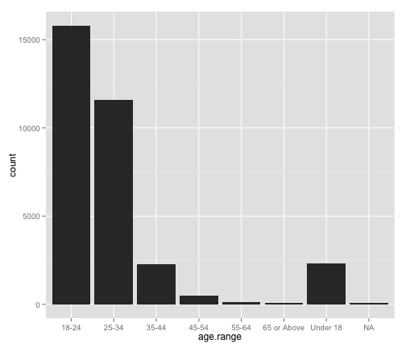
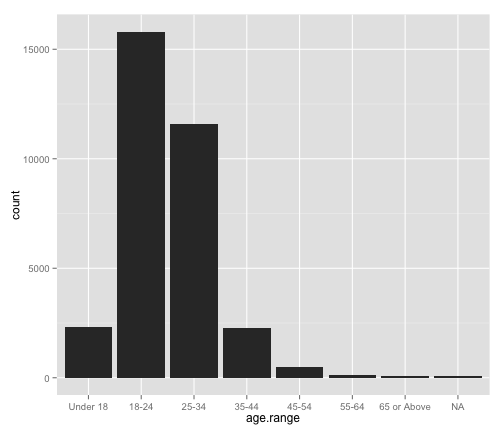

UD651 Lesson 2 Notes by mrandrewandrade
========================================================

UD651 Udacity's Exploratory Data Analysis Course Notes by Andrew Andrade || mrandrewandrade.com  || March 22nd, 2014 || (CC BY-NC 2.5)

### Lesson 2 Outline:

[Installing R and Rstudio](#P1)      


[Example1 ](#E1): c, nchar   
[Example2 ](#E2): data, names, ?, str, dim, row.names, head, tail, $  
[Example3 ](#E3): getwd, setwd, read.csv, subset, []    
[Example4 ](#E4): plot, summary, boolean operators, add and remove variables, ifelse, rm   
[Example5 ](#E5): factors, table, rearrange table    

[Appendix ](#Appendix):     
Dealing with Untidy Data   
R Markdown    
Free R Resources and Help     

***

### <a name="P1"></a>Install R and RStudio

Download and install the R programming language FIRST at http://cran.rstudio.com. 

After you install R, you can download and install RStudio from http://www.rstudio.com.

RStudio Layout Guide:   
http://dss.princeton.edu/training/RStudio101.pdf

***

### <a name="E1"></a>Example 1: Getting Started
Learn to use: c, nchar


```r
# Reset the workspace
rm(list = ls(all = TRUE))

# Store names in a vector
names <- c("Chris Saden", "Lauren Castellano", "Sarah Spikes", "Dean Eckles", 
    "Andy Brown", "Moira Burke", "Kunal Chawla")

# Display contents of vector
names
```

```
## [1] "Chris Saden"       "Lauren Castellano" "Sarah Spikes"     
## [4] "Dean Eckles"       "Andy Brown"        "Moira Burke"      
## [7] "Kunal Chawla"
```

```r

# Store 1 to 10 then 1 to 20 in a vector
numbers <- c(1:10)

# display
numbers
```

```
##  [1]  1  2  3  4  5  6  7  8  9 10
```

```r

# append 11:20
numbers <- c(numbers, 11:20)

# display
numbers
```

```
##  [1]  1  2  3  4  5  6  7  8  9 10 11 12 13 14 15 16 17 18 19 20
```


#### Display number of characters using nchar:

```r
# Reset the workspace
rm(list = ls(all = TRUE))

udacious <- c("Chris Saden", "Lauren Castellano", "Sarah Spikes", "Dean Eckles", 
    "Andy Brown", "Moira Burke", "Kunal Chawla", "Andrew Andrade")

# vector that contains the number of characters for each of the names in
# udacious, including my name.
nchar_output = nchar(udacious)
nchar_output
```

```
## [1] 11 17 12 11 10 11 12 14
```

```r

# Check if name in vector contains exactly 11 characters
nchar_output == 11
```

```
## [1]  TRUE FALSE FALSE  TRUE FALSE  TRUE FALSE FALSE
```

```r

# Output names with 11 charaters only
udacious[nchar_output == 11]
```

```
## [1] "Chris Saden" "Dean Eckles" "Moira Burke"
```

### <a name="E2"></a>Example 2: Understanding Dataframes

Learn to use: data, names, ?, str, dim, row.names, head, tail, $.


```r

# Reset the workspace
rm(list = ls(all = TRUE))

# load mtcars data
data(mtcars)
# display the variable names in mtcars
names(mtcars)
```

```
##  [1] "mpg"  "cyl"  "disp" "hp"   "drat" "wt"   "qsec" "vs"   "am"   "gear"
## [11] "carb"
```

```r
# display help
`?`(mtcars)
# display data frame in table form
mtcars
```

```
##                      mpg cyl  disp  hp drat    wt  qsec vs am gear carb
## Mazda RX4           21.0   6 160.0 110 3.90 2.620 16.46  0  1    4    4
## Mazda RX4 Wag       21.0   6 160.0 110 3.90 2.875 17.02  0  1    4    4
## Datsun 710          22.8   4 108.0  93 3.85 2.320 18.61  1  1    4    1
## Hornet 4 Drive      21.4   6 258.0 110 3.08 3.215 19.44  1  0    3    1
## Hornet Sportabout   18.7   8 360.0 175 3.15 3.440 17.02  0  0    3    2
## Valiant             18.1   6 225.0 105 2.76 3.460 20.22  1  0    3    1
## Duster 360          14.3   8 360.0 245 3.21 3.570 15.84  0  0    3    4
## Merc 240D           24.4   4 146.7  62 3.69 3.190 20.00  1  0    4    2
## Merc 230            22.8   4 140.8  95 3.92 3.150 22.90  1  0    4    2
## Merc 280            19.2   6 167.6 123 3.92 3.440 18.30  1  0    4    4
## Merc 280C           17.8   6 167.6 123 3.92 3.440 18.90  1  0    4    4
## Merc 450SE          16.4   8 275.8 180 3.07 4.070 17.40  0  0    3    3
## Merc 450SL          17.3   8 275.8 180 3.07 3.730 17.60  0  0    3    3
## Merc 450SLC         15.2   8 275.8 180 3.07 3.780 18.00  0  0    3    3
## Cadillac Fleetwood  10.4   8 472.0 205 2.93 5.250 17.98  0  0    3    4
## Lincoln Continental 10.4   8 460.0 215 3.00 5.424 17.82  0  0    3    4
## Chrysler Imperial   14.7   8 440.0 230 3.23 5.345 17.42  0  0    3    4
## Fiat 128            32.4   4  78.7  66 4.08 2.200 19.47  1  1    4    1
## Honda Civic         30.4   4  75.7  52 4.93 1.615 18.52  1  1    4    2
## Toyota Corolla      33.9   4  71.1  65 4.22 1.835 19.90  1  1    4    1
## Toyota Corona       21.5   4 120.1  97 3.70 2.465 20.01  1  0    3    1
## Dodge Challenger    15.5   8 318.0 150 2.76 3.520 16.87  0  0    3    2
## AMC Javelin         15.2   8 304.0 150 3.15 3.435 17.30  0  0    3    2
## Camaro Z28          13.3   8 350.0 245 3.73 3.840 15.41  0  0    3    4
## Pontiac Firebird    19.2   8 400.0 175 3.08 3.845 17.05  0  0    3    2
## Fiat X1-9           27.3   4  79.0  66 4.08 1.935 18.90  1  1    4    1
## Porsche 914-2       26.0   4 120.3  91 4.43 2.140 16.70  0  1    5    2
## Lotus Europa        30.4   4  95.1 113 3.77 1.513 16.90  1  1    5    2
## Ford Pantera L      15.8   8 351.0 264 4.22 3.170 14.50  0  1    5    4
## Ferrari Dino        19.7   6 145.0 175 3.62 2.770 15.50  0  1    5    6
## Maserati Bora       15.0   8 301.0 335 3.54 3.570 14.60  0  1    5    8
## Volvo 142E          21.4   4 121.0 109 4.11 2.780 18.60  1  1    4    2
```

```r

# display structur of data fram
str(mtcars)
```

```
## 'data.frame':	32 obs. of  11 variables:
##  $ mpg : num  21 21 22.8 21.4 18.7 18.1 14.3 24.4 22.8 19.2 ...
##  $ cyl : num  6 6 4 6 8 6 8 4 4 6 ...
##  $ disp: num  160 160 108 258 360 ...
##  $ hp  : num  110 110 93 110 175 105 245 62 95 123 ...
##  $ drat: num  3.9 3.9 3.85 3.08 3.15 2.76 3.21 3.69 3.92 3.92 ...
##  $ wt  : num  2.62 2.88 2.32 3.21 3.44 ...
##  $ qsec: num  16.5 17 18.6 19.4 17 ...
##  $ vs  : num  0 0 1 1 0 1 0 1 1 1 ...
##  $ am  : num  1 1 1 0 0 0 0 0 0 0 ...
##  $ gear: num  4 4 4 3 3 3 3 4 4 4 ...
##  $ carb: num  4 4 1 1 2 1 4 2 2 4 ...
```

```r

# displays the size of the data frame
dim(mtcars)
```

```
## [1] 32 11
```

```r

# help for row names
`?`(row.names)

# Change the row names of the cars to numbers.
row.names(mtcars) <- c(1:32)
# Show changes:
mtcars
```

```
##     mpg cyl  disp  hp drat    wt  qsec vs am gear carb
## 1  21.0   6 160.0 110 3.90 2.620 16.46  0  1    4    4
## 2  21.0   6 160.0 110 3.90 2.875 17.02  0  1    4    4
## 3  22.8   4 108.0  93 3.85 2.320 18.61  1  1    4    1
## 4  21.4   6 258.0 110 3.08 3.215 19.44  1  0    3    1
## 5  18.7   8 360.0 175 3.15 3.440 17.02  0  0    3    2
## 6  18.1   6 225.0 105 2.76 3.460 20.22  1  0    3    1
## 7  14.3   8 360.0 245 3.21 3.570 15.84  0  0    3    4
## 8  24.4   4 146.7  62 3.69 3.190 20.00  1  0    4    2
## 9  22.8   4 140.8  95 3.92 3.150 22.90  1  0    4    2
## 10 19.2   6 167.6 123 3.92 3.440 18.30  1  0    4    4
## 11 17.8   6 167.6 123 3.92 3.440 18.90  1  0    4    4
## 12 16.4   8 275.8 180 3.07 4.070 17.40  0  0    3    3
## 13 17.3   8 275.8 180 3.07 3.730 17.60  0  0    3    3
## 14 15.2   8 275.8 180 3.07 3.780 18.00  0  0    3    3
## 15 10.4   8 472.0 205 2.93 5.250 17.98  0  0    3    4
## 16 10.4   8 460.0 215 3.00 5.424 17.82  0  0    3    4
## 17 14.7   8 440.0 230 3.23 5.345 17.42  0  0    3    4
## 18 32.4   4  78.7  66 4.08 2.200 19.47  1  1    4    1
## 19 30.4   4  75.7  52 4.93 1.615 18.52  1  1    4    2
## 20 33.9   4  71.1  65 4.22 1.835 19.90  1  1    4    1
## 21 21.5   4 120.1  97 3.70 2.465 20.01  1  0    3    1
## 22 15.5   8 318.0 150 2.76 3.520 16.87  0  0    3    2
## 23 15.2   8 304.0 150 3.15 3.435 17.30  0  0    3    2
## 24 13.3   8 350.0 245 3.73 3.840 15.41  0  0    3    4
## 25 19.2   8 400.0 175 3.08 3.845 17.05  0  0    3    2
## 26 27.3   4  79.0  66 4.08 1.935 18.90  1  1    4    1
## 27 26.0   4 120.3  91 4.43 2.140 16.70  0  1    5    2
## 28 30.4   4  95.1 113 3.77 1.513 16.90  1  1    5    2
## 29 15.8   8 351.0 264 4.22 3.170 14.50  0  1    5    4
## 30 19.7   6 145.0 175 3.62 2.770 15.50  0  1    5    6
## 31 15.0   8 301.0 335 3.54 3.570 14.60  0  1    5    8
## 32 21.4   4 121.0 109 4.11 2.780 18.60  1  1    4    2
```

```r

# reload the data to reset row names
data(mtcars)

# display first 6 entries (default)
head(mtcars)
```

```
##                    mpg cyl disp  hp drat    wt  qsec vs am gear carb
## Mazda RX4         21.0   6  160 110 3.90 2.620 16.46  0  1    4    4
## Mazda RX4 Wag     21.0   6  160 110 3.90 2.875 17.02  0  1    4    4
## Datsun 710        22.8   4  108  93 3.85 2.320 18.61  1  1    4    1
## Hornet 4 Drive    21.4   6  258 110 3.08 3.215 19.44  1  0    3    1
## Hornet Sportabout 18.7   8  360 175 3.15 3.440 17.02  0  0    3    2
## Valiant           18.1   6  225 105 2.76 3.460 20.22  1  0    3    1
```

```r

# display first 10 entries
head(mtcars, 10)
```

```
##                    mpg cyl  disp  hp drat    wt  qsec vs am gear carb
## Mazda RX4         21.0   6 160.0 110 3.90 2.620 16.46  0  1    4    4
## Mazda RX4 Wag     21.0   6 160.0 110 3.90 2.875 17.02  0  1    4    4
## Datsun 710        22.8   4 108.0  93 3.85 2.320 18.61  1  1    4    1
## Hornet 4 Drive    21.4   6 258.0 110 3.08 3.215 19.44  1  0    3    1
## Hornet Sportabout 18.7   8 360.0 175 3.15 3.440 17.02  0  0    3    2
## Valiant           18.1   6 225.0 105 2.76 3.460 20.22  1  0    3    1
## Duster 360        14.3   8 360.0 245 3.21 3.570 15.84  0  0    3    4
## Merc 240D         24.4   4 146.7  62 3.69 3.190 20.00  1  0    4    2
## Merc 230          22.8   4 140.8  95 3.92 3.150 22.90  1  0    4    2
## Merc 280          19.2   6 167.6 123 3.92 3.440 18.30  1  0    4    4
```

```r

# display last 3 entries
tail(mtcars, 3)
```

```
##                mpg cyl disp  hp drat   wt qsec vs am gear carb
## Ferrari Dino  19.7   6  145 175 3.62 2.77 15.5  0  1    5    6
## Maserati Bora 15.0   8  301 335 3.54 3.57 14.6  0  1    5    8
## Volvo 142E    21.4   4  121 109 4.11 2.78 18.6  1  1    4    2
```

```r

# Access an individual variable (or column) from the data frame
mtcars$mpg
```

```
##  [1] 21.0 21.0 22.8 21.4 18.7 18.1 14.3 24.4 22.8 19.2 17.8 16.4 17.3 15.2
## [15] 10.4 10.4 14.7 32.4 30.4 33.9 21.5 15.5 15.2 13.3 19.2 27.3 26.0 30.4
## [29] 15.8 19.7 15.0 21.4
```

```r
# Find average of that column
mean(mtcars$mpg)
```

```
## [1] 20.09
```


#### Note: R uses 1 to start indexing (AND NOT ZERO BASED INDEXING as is true of many other programming languages.)

### <a name="E3"></a>Example 3: Read and Subset Data

Learn to use: getwd, setwd, read.csv, subset, []   
Reference: http://www.statmethods.net/management/subset.html   


```r
# Reset the workspace
rm(list = ls(all = TRUE))

# Get working directory
getwd()
```

```
## [1] "/Users/mrandrewandrade/UD651-Course-Notes/Course Notes/lesson2"
```

```r

# Set working directory (change to yours)
setwd("~/UD651-Course-Notes/Course Notes/lesson2/")

# Read in the state info data
statesInfo <- read.csv("stateData.csv")


# One method to store subset the states in region 1
stateSubset <- subset(statesInfo, 1 == state.region)


# Another method to subset the states in region 1
stateSubsetBraket <- statesInfo[statesInfo$state.region == 1, ]

```


### <a name="E4"></a>Example 4: Playing with the cars data set

Learn to use: plot, summary, boolean operators, add and remove variables, ifelse, rm


```r
# Reset the workspace
rm(list = ls(all = TRUE))

# look at prepacked cars data
`?`(cars)

# structure of cars
str(cars)
```

```
## 'data.frame':	50 obs. of  2 variables:
##  $ speed: num  4 4 7 7 8 9 10 10 10 11 ...
##  $ dist : num  2 10 4 22 16 10 18 26 34 17 ...
```


Plot:


```r
plot(cars)
```

 


```r
# show summary of data
summary(mtcars)
```

```
##       mpg            cyl            disp             hp       
##  Min.   :10.4   Min.   :4.00   Min.   : 71.1   Min.   : 52.0  
##  1st Qu.:15.4   1st Qu.:4.00   1st Qu.:120.8   1st Qu.: 96.5  
##  Median :19.2   Median :6.00   Median :196.3   Median :123.0  
##  Mean   :20.1   Mean   :6.19   Mean   :230.7   Mean   :146.7  
##  3rd Qu.:22.8   3rd Qu.:8.00   3rd Qu.:326.0   3rd Qu.:180.0  
##  Max.   :33.9   Max.   :8.00   Max.   :472.0   Max.   :335.0  
##       drat            wt            qsec            vs       
##  Min.   :2.76   Min.   :1.51   Min.   :14.5   Min.   :0.000  
##  1st Qu.:3.08   1st Qu.:2.58   1st Qu.:16.9   1st Qu.:0.000  
##  Median :3.69   Median :3.33   Median :17.7   Median :0.000  
##  Mean   :3.60   Mean   :3.22   Mean   :17.8   Mean   :0.438  
##  3rd Qu.:3.92   3rd Qu.:3.61   3rd Qu.:18.9   3rd Qu.:1.000  
##  Max.   :4.93   Max.   :5.42   Max.   :22.9   Max.   :1.000  
##        am             gear           carb     
##  Min.   :0.000   Min.   :3.00   Min.   :1.00  
##  1st Qu.:0.000   1st Qu.:3.00   1st Qu.:2.00  
##  Median :0.000   Median :4.00   Median :2.00  
##  Mean   :0.406   Mean   :3.69   Mean   :2.81  
##  3rd Qu.:1.000   3rd Qu.:4.00   3rd Qu.:4.00  
##  Max.   :1.000   Max.   :5.00   Max.   :8.00
```

```r

# store in efficient the Subset the data to cars that get 23 or more mpg
efficient <- subset(mtcars, mpg >= 23)

# number of cars taht get more than 23 mpg
dim(efficient)[1]
```

```
## [1] 7
```

```r


# subset car(s) that get greater than 30 mpg and have more than 100 raw
# horsepower.
subset(mtcars, mpg > 30 & hp > 100)
```

```
##               mpg cyl disp  hp drat    wt qsec vs am gear carb
## Lotus Europa 30.4   4 95.1 113 3.77 1.513 16.9  1  1    5    2
```

```r

# subset car(s) that get less than 14 mpg or have less more than 390 raw
# horsepower.
subset(mtcars, mpg < 14 | disp > 390)
```

```
##                      mpg cyl disp  hp drat    wt  qsec vs am gear carb
## Cadillac Fleetwood  10.4   8  472 205 2.93 5.250 17.98  0  0    3    4
## Lincoln Continental 10.4   8  460 215 3.00 5.424 17.82  0  0    3    4
## Chrysler Imperial   14.7   8  440 230 3.23 5.345 17.42  0  0    3    4
## Camaro Z28          13.3   8  350 245 3.73 3.840 15.41  0  0    3    4
## Pontiac Firebird    19.2   8  400 175 3.08 3.845 17.05  0  0    3    2
```

```r

# cars that have a 1/4 mile time (qsec) less than or equal to 16.90 seconds
# to the console.
subset(mtcars, qsec < (16.9 + 0.25) & qsec > (16.9 - 0.25))
```

```
##                    mpg cyl  disp  hp drat    wt  qsec vs am gear carb
## Mazda RX4 Wag     21.0   6 160.0 110 3.90 2.875 17.02  0  1    4    4
## Hornet Sportabout 18.7   8 360.0 175 3.15 3.440 17.02  0  0    3    2
## Dodge Challenger  15.5   8 318.0 150 2.76 3.520 16.87  0  0    3    2
## Pontiac Firebird  19.2   8 400.0 175 3.08 3.845 17.05  0  0    3    2
## Porsche 914-2     26.0   4 120.3  91 4.43 2.140 16.70  0  1    5    2
## Lotus Europa      30.4   4  95.1 113 3.77 1.513 16.90  1  1    5    2
```

```r

# Save the subset of cars that weigh under 2000 pounds (weight is measured
# in lb/1000) to a variable called lightCars. Print the numbers of cars and
# the subset to the console.
lightCars <- subset(mtcars, wt < 2)
dim(lightCars)[1]
```

```
## [1] 4
```

```r
lightCars
```

```
##                 mpg cyl disp  hp drat    wt  qsec vs am gear carb
## Honda Civic    30.4   4 75.7  52 4.93 1.615 18.52  1  1    4    2
## Toyota Corolla 33.9   4 71.1  65 4.22 1.835 19.90  1  1    4    1
## Fiat X1-9      27.3   4 79.0  66 4.08 1.935 18.90  1  1    4    1
## Lotus Europa   30.4   4 95.1 113 3.77 1.513 16.90  1  1    5    2
```

```r

# Create new variables in a data frame (add year) assume that all of the
# models were from 1974.
mtcars$year <- 1974

# remove variable
mtcars <- subset(mtcars, select = -year)
# Notice, we are back to 11 variables in the data frame.

# set years 1973 and 1974 alternating
mtcars$year <- c(1973, 1974)

# remove again
mtcars <- subset(mtcars, select = -year)

# check if the car weight is less than 3
mtcars$wt
```

```
##  [1] 2.620 2.875 2.320 3.215 3.440 3.460 3.570 3.190 3.150 3.440 3.440
## [12] 4.070 3.730 3.780 5.250 5.424 5.345 2.200 1.615 1.835 2.465 3.520
## [23] 3.435 3.840 3.845 1.935 2.140 1.513 3.170 2.770 3.570 2.780
```

```r
cond <- mtcars$wt < 3
cond
```

```
##  [1]  TRUE  TRUE  TRUE FALSE FALSE FALSE FALSE FALSE FALSE FALSE FALSE
## [12] FALSE FALSE FALSE FALSE FALSE FALSE  TRUE  TRUE  TRUE  TRUE FALSE
## [23] FALSE FALSE FALSE  TRUE  TRUE  TRUE FALSE  TRUE FALSE  TRUE
```

```r

# using ifelse

# if true, then set to light
mtcars$weight_class <- ifelse(cond, "light", "average")
mtcars$weight_class
```

```
##  [1] "light"   "light"   "light"   "average" "average" "average" "average"
##  [8] "average" "average" "average" "average" "average" "average" "average"
## [15] "average" "average" "average" "light"   "light"   "light"   "light"  
## [22] "average" "average" "average" "average" "light"   "light"   "light"  
## [29] "average" "light"   "average" "light"
```

```r

# check if the car weight is greater than 3.5
cond <- mtcars$wt > 3.5

# if true then set to heavy
mtcars$weight_class <- ifelse(cond, "heavy", mtcars$weight_class)
mtcars$weight_class
```

```
##  [1] "light"   "light"   "light"   "average" "average" "average" "heavy"  
##  [8] "average" "average" "average" "average" "heavy"   "heavy"   "heavy"  
## [15] "heavy"   "heavy"   "heavy"   "light"   "light"   "light"   "light"  
## [22] "heavy"   "average" "heavy"   "heavy"   "light"   "light"   "light"  
## [29] "average" "light"   "heavy"   "light"
```

```r

# remove individual environment variables
rm(cond)
rm(efficient)
```


Quiz: Which car(s) have an mpg (miles per gallon) greater than or equal to 30
OR hp (horsepower) less than 60? Create an R chunk of code to answer the question.

Solution:

```r
solution <- subset(mtcars, mpg >= 30 | hp < 60)[0]
```


### <a name="E5"></a>Example 5: Factor Variables
Reference:   
Data type: http://www.statmethods.net/input/datatypes.html   
Reddit Data: http://www.redditblog.com/2011/09/who-in-world-is-reddit-results-are-in.html   

Learn to use: factors, table, rearrange table


```r
# Reset the workspace
rm(list = ls(all = TRUE))

# Read reddit data
reddit <- read.csv("reddit.csv")

# summary of data
summary(reddit)
```

```
##        id            gender        age.range    
##  Min.   :    1   Min.   :0.00   18-24   :15802  
##  1st Qu.: 8189   1st Qu.:0.00   25-34   :11575  
##  Median :16380   Median :0.00   Under 18: 2330  
##  Mean   :16379   Mean   :0.19   35-44   : 2257  
##  3rd Qu.:24568   3rd Qu.:0.00   45-54   :  502  
##  Max.   :32756   Max.   :1.00   (Other) :  200  
##                  NA's   :201    NA's    :   88  
##                                   marital.status 
##  Engaged                                 : 1109  
##  Forever Alone                           : 5850  
##  In a relationship                       : 9828  
##  Married/civil union/domestic partnership: 5490  
##  Single                                  :10428  
##  Widowed                                 :   44  
##  NA's                                    :    5  
##                              employment.status military.service
##  Employed full time                   :14814   No  :30526      
##  Freelance                            : 1948   Yes : 2223      
##  Not employed and not looking for work:  682   NA's:    5      
##  Not employed, but looking for work   : 2087                   
##  Retired                              :   85                   
##  Student                              :12987                   
##  NA's                                 :  151                   
##  children                                  education    
##  No  :27488   Bachelor's degree                 :11046  
##  Yes : 5047   Some college                      : 9600  
##  NA's:  219   Graduate or professional degree   : 4722  
##               High school graduate or equivalent: 3272  
##               Some high school                  : 1924  
##               (Other)                           : 2046  
##               NA's                              :  144  
##            country             state                    income.range 
##  United States :20967             :11908   Under $20,000      :7892  
##  Canada        : 2888   California: 3401   $50,000 - $69,999  :4133  
##  United Kingdom: 1782   Texas     : 1541   $70,000 - $99,999  :4101  
##  Australia     : 1051   New York  : 1418   $100,000 - $149,999:3522  
##  Germany       :  407   Illinois  :  976   $20,000 - $29,999  :3206  
##  (Other)       : 5482   Washington:  910   (Other)            :8285  
##  NA's          :  177   (Other)   :12600   NA's               :1615  
##                fav.reddit               dog.cat            cheese    
##                     : 4335   I like cats.   :11156   Other    :6563  
##  askreddit          : 2123   I like dogs.   :17151   Cheddar  :6102  
##  fffffffuuuuuuuuuuuu: 1746   I like turtles.: 4442   Brie     :3742  
##  pics               : 1651   NA's           :    5   Provolone:3456  
##  trees              : 1311                           Swiss    :3214  
##  (Other)            :21562                           (Other)  :9672  
##  NA's               :   26                           NA's     :   5
```

```r

# Check the structure and notice factors
str(reddit)
```

```
## 'data.frame':	32754 obs. of  14 variables:
##  $ id               : int  1 2 3 4 5 6 7 8 9 10 ...
##  $ gender           : int  0 0 1 0 1 0 0 0 0 0 ...
##  $ age.range        : Factor w/ 7 levels "18-24","25-34",..: 2 2 1 2 2 2 2 1 3 2 ...
##  $ marital.status   : Factor w/ 6 levels "Engaged","Forever Alone",..: NA NA NA NA NA 4 3 4 4 3 ...
##  $ employment.status: Factor w/ 6 levels "Employed full time",..: 1 1 2 2 1 1 1 4 1 2 ...
##  $ military.service : Factor w/ 2 levels "No","Yes": NA NA NA NA NA 1 1 1 1 1 ...
##  $ children         : Factor w/ 2 levels "No","Yes": 1 1 1 1 1 1 1 1 1 1 ...
##  $ education        : Factor w/ 7 levels "Associate degree",..: 2 2 5 2 2 2 5 2 2 5 ...
##  $ country          : Factor w/ 439 levels " Canada"," Canada eh",..: 394 394 394 394 394 394 125 394 394 125 ...
##  $ state            : Factor w/ 53 levels "","Alabama","Alaska",..: 33 33 48 33 6 33 1 6 33 1 ...
##  $ income.range     : Factor w/ 8 levels "$100,000 - $149,999",..: 2 2 8 2 7 2 NA 7 2 7 ...
##  $ fav.reddit       : Factor w/ 1834 levels "","___","-","?",..: 720 691 1511 1528 188 691 1318 571 1629 1 ...
##  $ dog.cat          : Factor w/ 3 levels "I like cats.",..: NA NA NA NA NA 2 2 2 1 1 ...
##  $ cheese           : Factor w/ 11 levels "American","Brie",..: NA NA NA NA NA 3 3 1 10 7 ...
```

```r

# table specific factor (employment status)
table(reddit$employment.status)
```

```
## 
##                    Employed full time 
##                                 14814 
##                             Freelance 
##                                  1948 
## Not employed and not looking for work 
##                                   682 
##    Not employed, but looking for work 
##                                  2087 
##                               Retired 
##                                    85 
##                               Student 
##                                 12987
```


```r
# plot the age of users
levels(reddit$age.range)
```

```
## [1] "18-24"       "25-34"       "35-44"       "45-54"       "55-64"      
## [6] "65 or Above" "Under 18"
```

```r

# use the ggplot library
library(ggplot2)

```


Plot:


```r
qplot(data = reddit, x = age.range)
```

 


Notice how the x variables on the plot are out of order for Under 18.

Reorder the variables:

Reference: http://statistics.ats.ucla.edu/stat/r/modules/factor_variables.htm


```r
reddit$age.range <- ordered(reddit$age.range, levels = c("Under 18", "18-24", 
    "25-34", "35-44", "45-54", "55-64", "65 or Above"))
```


Plot:


```r
qplot(data = reddit, x = age.range)
```

 


Alternate Solution:


```r
reddit$age.range <- factor(reddit$age.range, levels = c("Under 18", "18-24", 
    "25-34", "35-44", "45-54", "55-64", "65 or Above"), ordered = T)
```


Plot:


```r
qplot(data = reddit, x = age.range)
```

 


# CONGRATULATIONS
#### You'll be exploring data soon with your new knowledge of R.

***
## <a name="Appendix"></a>Appendix

### Dealing with untidy data: Learn data wrangling
https://www.udacity.com/course/ud032   
Tidy Data by Hadley Wickham:   
http://courses.had.co.nz.s3-website-us-east-1.amazonaws.com/12-rice-bdsi/slides/07-tidy-data.pdf   
Tidy Data Presentation by Hadley Whickman (June 2012)   
http://vita.had.co.nz/papers/tidy-data.pdf   

***

### R Markdown    

Code to install knitr for markdown:   

install.packages('knitr', dependencies = T)   
library(knitr)   

Intro Video:   
https://www.youtube.com/watch?v=6A5EpqqDOdk   
Cheat Sheets:      
Help->Markdown Quick Reference   
https://github.com/adam-p/markdown-here/wiki/Markdown-Cheatsheet      
http://warpedvisions.org/projects/markdown-cheat-sheet.md      

Hooks for creating PDF, MS Word etc:    
https://github.com/rstudio/rmarkdown

Code to install
install.packages("devtools")    
devtools::install_github("rstudio/rmarkdown")


### Free R Resources and Help 
http://tryr.codeschool.com/   
https://www.datacamp.com/   
http://www.statmethods.net/  
http://www.cookbook-r.com/  
http://www.r-bloggers.com/  
http://stackoverflow.com/tags/r/info  
http://stackoverflow.com/questions/tagged/r-faq%20  

***
