UD651 Lesson 3 Notes by mrandrewandrade
========================================================

UD651 Udacity's Exploratory Data Analysis Course Notes by Andrew Andrade || mrandrewandrade.com  || March 23rd, 2014 || (CC BY-NC 2.5)


### Lesson 3 Outline:
Lesson 3 teaches us techniques how explore one variable in R.  We take a close look at individual variables in data set, types of variables, distrbution of data, missing data and outliers.

[Installing ggplot and ggplot themes](#P1)     
[Example 1: Setting up gglot ](#E1):  list.files(), read.delim, load ggplot2 and ggthemes library, scale_x_discrete        
[Example 2: Faceting](#E2): facet_wrap and facet_grid in qplot and ggplot     
[Example 3: Limiting and labling axis, adjusting bin width ](#E3): xlim, scale_x_continous     
[Example 4: Faceting friend count into men and women and filtering NA values](#E4): facet_wrap, by     
[Example 5: Playing with color themes and exploring tensure and ages](#E5): color, fill, xlab, ylab     
[Example 6: Transforming data](#E6): log10, sqrt     
[Example 7: Overlaying Frequency Polygons to count total friends and likes](#E7): frequency polygons, overlay plots,  subset       
[Example 8: Box plot](#E8): boxplot, setting coordinatesand limits on boxplot (coord_cartesian)      
[Example 9: Adding new logical variables](#E9): Creating logical variables from what you learnt      


***********

### <a name="P1"></a>Install ggplot and ggplot themes

Run the follow commands in the RStudio terminal:
>install.packages('ggplot2')
>install.packages('ggthemes', dependencies = TRUE) 


### <a name="E1"></a>Example 1: Setting up gglot  
Learn to use: list.files(), read.delim, load ggplot2 and ggthemes library, scale_x_discrete


```r
# Reset the workspace
rm(list = ls(all = TRUE))

# check working directory
getwd()
```

```
## [1] "/Users/mrandrewandrade/UD651-Course-Notes/Course Notes/lesson3"
```

```r

# set working directory if incorrect
setwd("~/UD651-Course-Notes/Course Notes/lesson3/")

# list files in directory
list.files()
```

```
## [1] "figure"              "lesson3_notes.html"  "lesson3_notes.md"   
## [4] "lesson3_notes.Rmd"   "pseudo_facebook.tsv"
```

```r

# read.delim defaults to the tab character as the separator between values
# and the period as the decimal character.
pf <- read.delim("pseudo_facebook.tsv")
names(pf)
```

```
##  [1] "userid"                "age"                  
##  [3] "dob_day"               "dob_year"             
##  [5] "dob_month"             "gender"               
##  [7] "tenure"                "friend_count"         
##  [9] "friendships_initiated" "likes"                
## [11] "likes_received"        "mobile_likes"         
## [13] "mobile_likes_received" "www_likes"            
## [15] "www_likes_received"
```

```r

# load required libraries
library(ggplot2)
library(ggthemes)
```


```r
# simple histogram of date of births
qplot(x = dob_day, data = pf) + scale_x_discrete(breaks = 1:31)
```

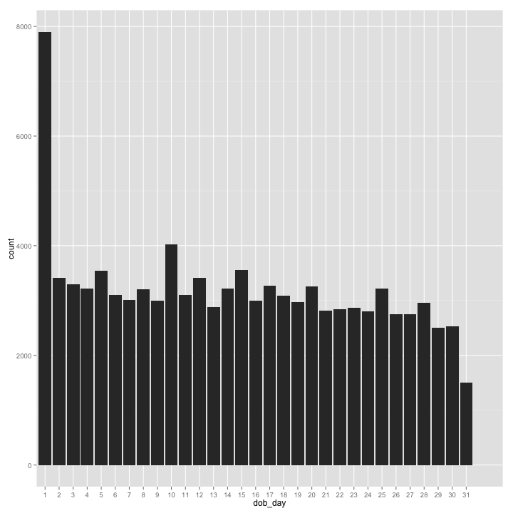 


### <a name="E2"></a>Faceting
Reference: http://www.cookbook-r.com/Graphs/Facets_(ggplot2)/      
Learn to use: facet_wrap and facet_grid in qplot and ggplot


Single Variable Syntax:
facet_wrap(~variable)

Multiple variable Syntax:
facet_grid(vertical~horizontal)

Example using qplot:

```r
# simple histogram of date of births
qplot(x = dob_day, data = pf) + scale_x_discrete(breaks = 1:31) + facet_wrap(~dob_month, 
    ncol = 4)
```

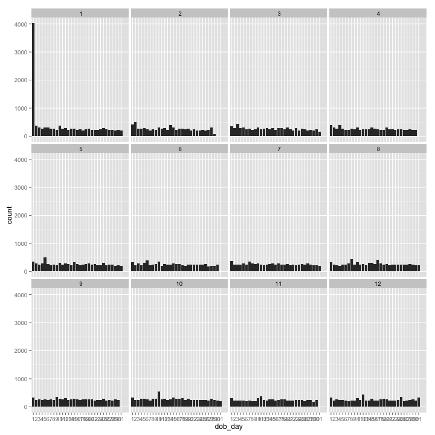 


Example using ggplot:

```r
# simple histogram of date of births\
ggplot(data = pf, aes(x = dob_day)) + geom_histogram() + scale_x_discrete(breaks = 1:31) + 
    facet_wrap(~dob_month)
```

 


### <a name="E3"></a>Example 3: Limiting and labling axis, adjusting bin width
Reference: http://docs.ggplot2.org/current/scale_continuous.html      
Learn to use:  xlim, scale_x_continous, 

#### Limiting the Axis to 0 to 1000

Using xlim:

```r
# simple histogram of date of births
qplot(x = friend_count, data = pf, xlim = c(0, 1000))
```

```
## stat_bin: binwidth defaulted to range/30. Use 'binwidth = x' to adjust this.
```

 


Using scale_x_continous:

```r
# simple histogram of date of births
qplot(x = friend_count, data = pf) + scale_x_continuous(limits = c(0, 1000))
```

```
## stat_bin: binwidth defaulted to range/30. Use 'binwidth = x' to adjust this.
```

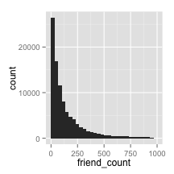 


Using ggplot:

```r
# simple histogram of date of births
ggplot(aes(x = friend_count), data = pf) + geom_histogram() + scale_x_continuous(limits = c(0, 
    1000))
```

```
## stat_bin: binwidth defaulted to range/30. Use 'binwidth = x' to adjust this.
```

 


#### Breaks to Set Axis Labels

Using xlim:

```r
qplot(x = friend_count, data = pf, binwidth = 25) + scale_x_continuous(limits = c(0, 
    1000), breaks = seq(0, 1000, 50))
```

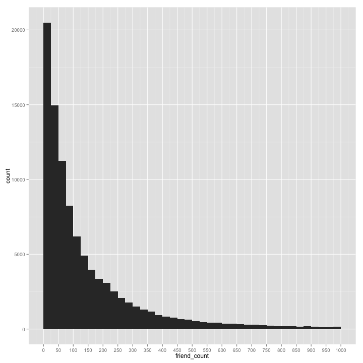 


Using ggplot:

```r

ggplot(aes(x = friend_count), data = pf) + geom_histogram() + scale_x_continuous(limits = c(0, 
    1000), breaks = seq(0, 1000, 50))
```

```
## stat_bin: binwidth defaulted to range/30. Use 'binwidth = x' to adjust this.
```

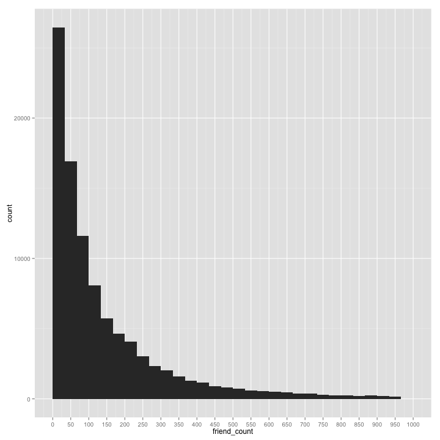 

```r

```


### <a name="E4"></a>Example 4: Faceting friend count into men and women and filtering NA values
Reference: http://www.statmethods.net/input/missingdata.html
Learn to use: facet_wrap, by


Using qplot:


```r
qplot(x = friend_count, data = subset(pf, !is.na(gender)), binwidth = 25) + 
    scale_x_continuous(limits = c(0, 1000), breaks = seq(0, 1000, 50)) + facet_wrap(~gender)
```

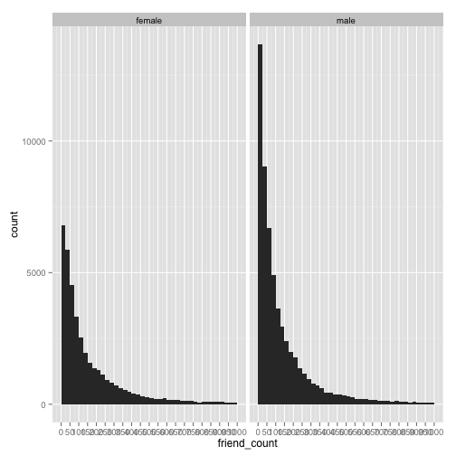 


Using ggplot

```r
ggplot(aes(x = friend_count), data = subset(pf, !is.na(gender))) + geom_histogram() + 
    scale_x_continuous(limits = c(0, 1000), breaks = seq(0, 1000, 50)) + facet_wrap(~gender)
```

```
## stat_bin: binwidth defaulted to range/30. Use 'binwidth = x' to adjust this.
## stat_bin: binwidth defaulted to range/30. Use 'binwidth = x' to adjust this.
```

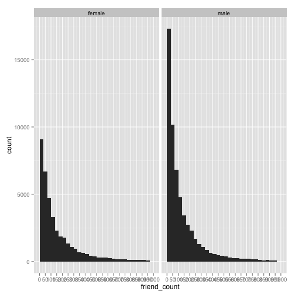 


We can now look at the total friend count:

```r

# using table to compare totals between genders
table(pf$gender)
```

```
## 
## female   male 
##  40254  58574
```

```r

# using by wrapper to compare summaries of male and female
by(pf$friend_count, pf$gender, summary)
```

```
## pf$gender: female
##    Min. 1st Qu.  Median    Mean 3rd Qu.    Max. 
##       0      37      96     242     244    4920 
## -------------------------------------------------------- 
## pf$gender: male
##    Min. 1st Qu.  Median    Mean 3rd Qu.    Max. 
##       0      27      74     165     182    4920
```


### <a name="E5"></a> Example 5: Playing with color themes and exploring tensure and ages
Reference: http://docs.ggplot2.org/0.9.2.1/theme.html
Learn to use: color, fill, xlab, ylab

Using qplot:

```r
# color determins the outline of objects fill determines the color of area
# inside object in plot
qplot(x = tenure/365, data = pf, binwidth = 0.25, color = I("black"), fill = I("#099DD9")) + 
    scale_x_continuous(breaks = seq(1, 7, 1), limits = c(0, 7)) + xlab("Number of years using Facebook") + 
    ylab("Number of users in sample")
```

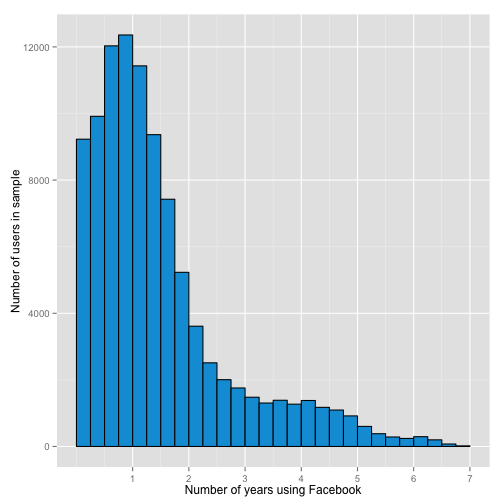 


Using ggplot:

```r
ggplot(aes(x = tenure/365), data = pf) + geom_histogram(color = "black", fill = "#099DD9") + 
    scale_x_continuous(breaks = seq(1, 7, 1), limits = c(0, 7)) + xlab("Number of years using Facebook") + 
    ylab("Number of users in sample")
```

```
## stat_bin: binwidth defaulted to range/30. Use 'binwidth = x' to adjust this.
```

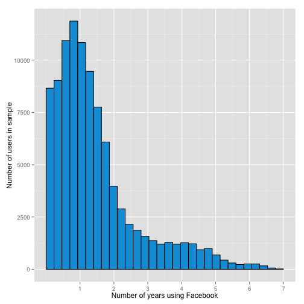 


User ages:

```r
# color determines the outline of objects fill determines the color of area
# inside object in plot
qplot(x = age, data = pf, binwidth = 1, color = I("black"), fill = I("#099DD9")) + 
    scale_x_continuous(breaks = seq(0, 113, 5))
```

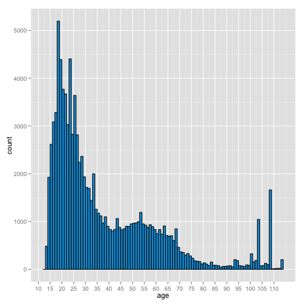 


### <a name="E6"></a> Example 6: Transforming data
Reference:       
Creating multiple plots in one image:      
http://lightonphiri.org/blog/ggplot2-multiple-plots-in-one-graph-using-gridextra       
Add Log or Sqrt Scales to an Axis:     
http://docs.ggplot2.org/current/scale_continuous.html     

Learn to use: log10, sqrt


First install:
>install.packages("gridExtra")

Learn to use:

Transforming friend count data:


```r
# Summary of Friend Count
summary(pf$friend_count, data)
```

```
##    Min. 1st Qu.  Median    Mean 3rd Qu.    Max. 
##       0      31      82     196     206    4920
```

```r

# Summary of log of Friend Count
summary(log10(pf$friend_count + 1), data)
```

```
##    Min. 1st Qu.  Median    Mean 3rd Qu.    Max. 
##    0.00    1.51    1.92    1.87    2.32    3.69
```

```r

# Summary of sqrt of Friend Count
summary(sqrt(pf$friend_count + 1), data)
```

```
##    Min. 1st Qu.  Median    Mean 3rd Qu.    Max. 
##    1.00    5.66    9.11   11.20   14.40   70.20
```

```r

```


One plot of the transformed data using QPlot:

Using qplot:


```r

library(gridExtra)
```

```
## Loading required package: grid
```

```r

p1 <- qplot(x = friend_count, data = pf)
p2 <- qplot(x = log10(friend_count + 1), data = pf)
p3 <- qplot(x = sqrt(friend_count), data = pf)

# arrange plots in grid
grid.arrange(p1, p2, p3, ncol = 1)
```

```
## stat_bin: binwidth defaulted to range/30. Use 'binwidth = x' to adjust this.
## stat_bin: binwidth defaulted to range/30. Use 'binwidth = x' to adjust this.
## stat_bin: binwidth defaulted to range/30. Use 'binwidth = x' to adjust this.
```

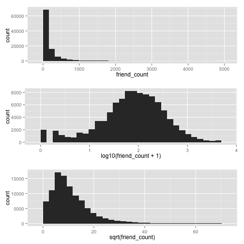 


Using ggplot:


```r

library(gridExtra)

p1 <- ggplot(aes(x = friend_count), dat = pf) + geom_histogram()
p2 <- p1 + scale_x_log10()
p3 <- p2 + scale_x_sqrt()
```

```
## Scale for 'x' is already present. Adding another scale for 'x', which will replace the existing scale.
```

```r

# arrange plots in grid
grid.arrange(p1, p2, p3, ncol = 1)
```

```
## stat_bin: binwidth defaulted to range/30. Use 'binwidth = x' to adjust this.
## stat_bin: binwidth defaulted to range/30. Use 'binwidth = x' to adjust this.
## stat_bin: binwidth defaulted to range/30. Use 'binwidth = x' to adjust this.
```

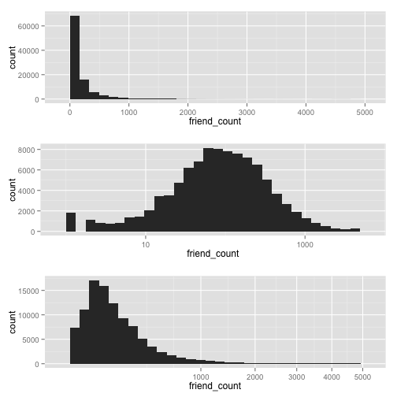 


### <a name="E7"></a> Example 7: Overlaying Frequency Polygons to count total friends and likes 

Learn to use: frequency polygons, overlay plots,  subset

Using qplot:


```r
qplot(x = friend_count, y = ..count../sum(..count..), data = subset(pf, !is.na(gender)), 
    xlab = "Friend Count", ylab = "Proportion of Users with that friend count", 
    binwidth = 10, geom = "freqpoly", color = gender) + scale_x_continuous(lim = c(0, 
    1000), breaks = seq(0, 1000, 200))
```

```
## Warning: Removed 2 rows containing missing values (geom_path).
## Warning: Removed 2 rows containing missing values (geom_path).
```

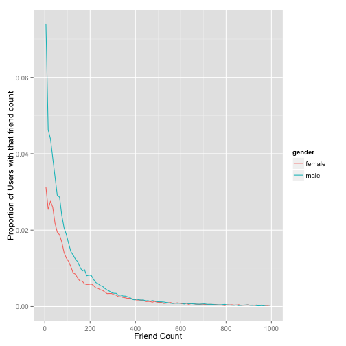 


Using ggplot:


```r
ggplot(aes(x = friend_count, y = ..count../sum(..count..)), data = subset(pf, 
    !is.na(gender))) + geom_freqpoly(aes(color = gender)) + scale_x_continuous(limits = c(0, 
    1000), breaks = seq(0, 1000, 200)) + xlab("Friend Count") + ylab("Percentage of users with that friend count")
```

```
## stat_bin: binwidth defaulted to range/30. Use 'binwidth = x' to adjust this.
```

```
## Warning: Removed 2 rows containing missing values (geom_path).
## Warning: Removed 2 rows containing missing values (geom_path).
```

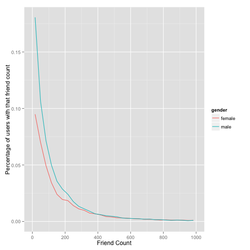 


Visualizing www_likes

Using qplot:


```r
qplot(x = www_likes, data = subset(pf, !is.na(gender)), geom = "freqpoly", color = gender) + 
    scale_x_continuous() + scale_x_log10()
```

```
## Scale for 'x' is already present. Adding another scale for 'x', which will replace the existing scale.
## stat_bin: binwidth defaulted to range/30. Use 'binwidth = x' to adjust this.
```

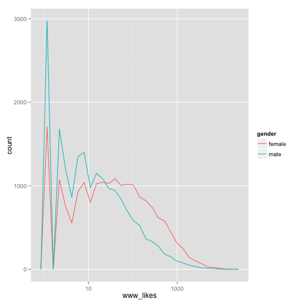 

```r

```


Using ggplot:


```r
ggplot(aes(x = www_likes), data = subset(pf, !is.na(gender))) + geom_freqpoly(aes(color = gender)) + 
    scale_x_log10()
```

```
## stat_bin: binwidth defaulted to range/30. Use 'binwidth = x' to adjust this.
```

 


Counting the total likes of men and women


```r
# longer solution storing the numbers
males <- subset(pf, gender == "male")
maleNumberLikes <- sum(males$www_likes)

females <- subset(pf, gender == "female")
femaleNumberLikes <- sum(females$www_likes)

# shorter solution, just display the numbers
by(pf$www_likes, pf$gender, sum)
```

```
## pf$gender: female
## [1] 3507665
## -------------------------------------------------------- 
## pf$gender: male
## [1] 1430175
```


### <a name="E8"></a> Example 8: Box plot
Reference: http://flowingdata.com/2008/02/15/how-to-read-and-use-a-box-and-whisker-plot/

Learn to use: boxplot, setting coordinatesand limits on boxplot (coord_cartesian)


Using scale_y_continuous or y lim:


```r

# using scale y continous
qplot(x = gender, y = friend_count, data = subset(pf, !is.na(gender)), geom = "boxplot") + 
    scale_y_continuous(limits = c(0, 1000))
```

```
## Warning: Removed 2949 rows containing non-finite values (stat_boxplot).
```

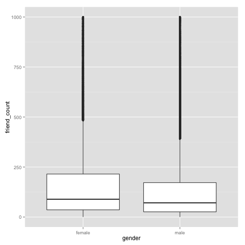 

```r

# using y continous
qplot(x = gender, y = friend_count, data = subset(pf, !is.na(gender)), geom = "boxplot", 
    ylim = c(0, 1000))
```

```
## Warning: Removed 2949 rows containing non-finite values (stat_boxplot).
```

 

```r

# using coord_cartesian
qplot(x = gender, y = friend_count, data = subset(pf, !is.na(gender)), geom = "boxplot") + 
    coord_cartesian(ylim = c(0, 1000))
```

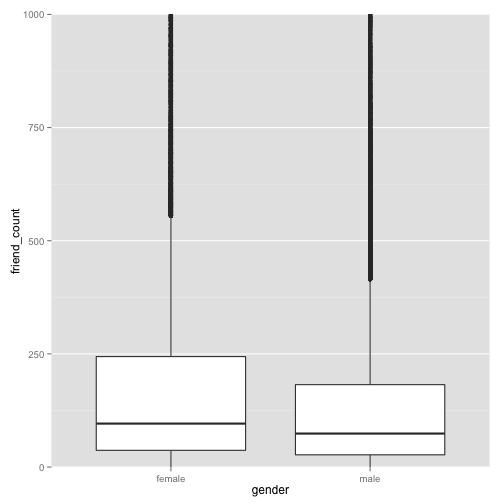 


Compare with the summary table:


```r

# using coord_cartesian
qplot(x = gender, y = friend_count, data = subset(pf, !is.na(gender)), geom = "boxplot") + 
    coord_cartesian(ylim = c(0, 250))
```

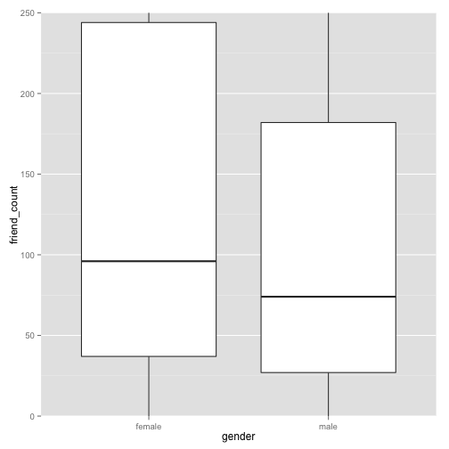 

```r

by(pf$friend_count, pf$gender, summary)
```

```
## pf$gender: female
##    Min. 1st Qu.  Median    Mean 3rd Qu.    Max. 
##       0      37      96     242     244    4920 
## -------------------------------------------------------- 
## pf$gender: male
##    Min. 1st Qu.  Median    Mean 3rd Qu.    Max. 
##       0      27      74     165     182    4920
```

```r

```


Compare who initiaties more more friendships:


```r

by(pf$friendships_initiated, pf$gender, summary)
```

```
## pf$gender: female
##    Min. 1st Qu.  Median    Mean 3rd Qu.    Max. 
##       0      19      49     114     125    3650 
## -------------------------------------------------------- 
## pf$gender: male
##    Min. 1st Qu.  Median    Mean 3rd Qu.    Max. 
##       0      15      44     103     111    4140
```

```r

qplot(x = gender, y = friendships_initiated, data = subset(pf, !is.na(gender)), 
    geom = "boxplot") + coord_cartesian(ylim = c(0, 1000))
```

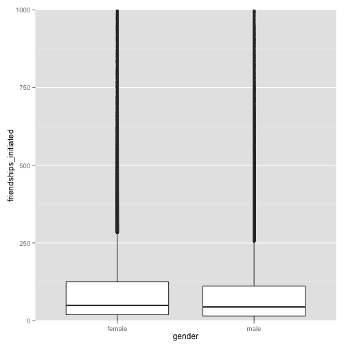 


### <a name="E9"></a> Example 9: Adding new logical variables

Learn to use: what you have learned to create logical variables


```r

pf$mobile_check_in <- NA
pf$mobile_check_in <- ifelse(pf$mobile_likes > 0, TRUE, FALSE)
pf$mobile_check_in <- factor(pf$mobile_check_in)
summary(pf$mobile_check_in)
```

```
## FALSE  TRUE 
## 35056 63947
```

```r

percentMobileCheckins <- sum(TRUE == pf$mobile_check_in)/length(pf$mobile_check_in) * 
    100

# display the number of mobile check ins
percentMobileCheckins
```

```
## [1] 64.59
```


********
# CONGRATULATIONS
#### You'll now learnt the basics of exploring one variable.  Time to put the knowledge to use!
